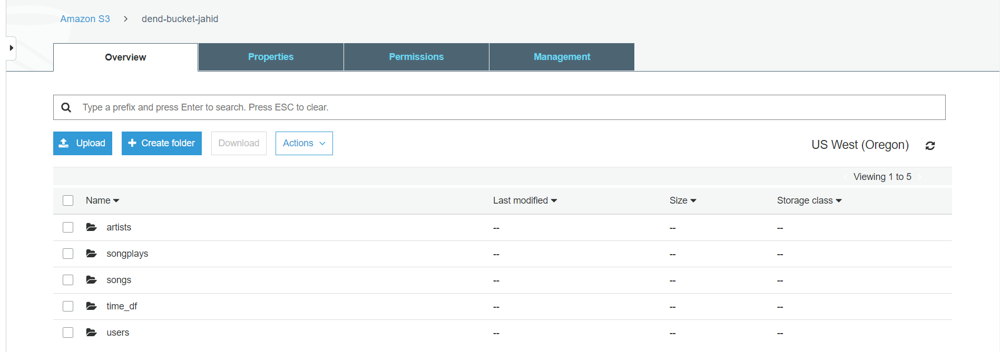

# Data Engineering Nano Degree- Project 3

## 1. Background & Objective of the Project

A music streaming startup, Sparkify, has grown their user base and song database even more and want to move their data warehouse to a data lake. Their data resides in S3, in a directory of JSON logs on user activity on the app, as well as a directory with JSON metadata on the songs in their app.

The objective of this project is to build an ETL pipeline for Sparkify that extracts their data from S3, processes them using Spark, and loads the data back into S3 as a set of dimensional tables. This will allow their analytics team to continue finding insights in what songs their users are listening to.

To complete the project, data is loaded from S3, processed into analytics tables using Spark, and load them back into S3. Spark process is deployed on a cluster using AWS.

## 2. Dataset

A. **Song Dataset**: For this project we use the son data kep in the following location: Song data:**s3://udacity-dend/song_data**

The Song dataset is a subset of real data from the [Million Song Dataset](https://labrosa.ee.columbia.edu/millionsong/). Each file is in JSON format and contains metadata about a song and the artist of that song. The files are partitioned by the first three letters of each song's track ID.

Below is an example of what a single song file, TRAABJL12903CDCF1A.json, looks like:

> {"num_songs": 1, "artist_id": "ARJIE2Y1187B994AB7", "artist_latitude": null, "artist_longitude": null, "artist_location": "", "artist_name": "Line Renaud", "song_id": "SOUPIRU12A6D4FA1E1", "title": "Der Kleine Dompfaff", "duration": 152.92036, "year": 0}

B. **Log Dataset**: We use the log data from the udacity s3 bucket: Log data: **s3://udacity-dend/log_data**

The log dataset consists of log files in JSON format generated by this [event simulator](https://github.com/Interana/eventsim) based on the songs in the dataset above. These simulate app activity logs from a music streaming app based on specified configurations.The log files used in the dataset are partitioned by year and month. 

Here are filepaths to two files in this dataset:

> 1. `log_data/2018/11/2018-11-12-events.json`
> 2. `log_data/2018/11/2018-11-13-events.json`

## 3. Fact and Dimension Tables

**Fact Table** contains records in log data associated with song plays such as:

1. **songplay_id, start_time, user_id, level, song_id, artist_id, session_id, location and user_agent**.

**Dimension Table**: The dimension table contains the attributes related to the song and help to store the context of the business. The dimension table contains the following items-

2. **users**: contain the users in the app and have the following columns- user_id, first_name, last_name, gender, level

3. **songs**: contains the songs in music database and have the song_id, title, artist_id, year, duration

4. **artists** - contains the artists in music database. It has the properties of artist_id, name, location, lattitude, longitude

5. **time** - contains the timestamps of records in songplays broken down into specific units
start_time, hour, day, week, month, year, weekday

## 4. File Descriptions

1. `etl.py` is used to read data from udacity's S3 bucket, makig the transformationg using Spark, and saving the data back to S3 bucket. 

2. `dl_test.ipynb` file is used to check whether the facts and dimensions tables have been created properly.

3. dl.cfg contains my AWS credential required to access AWS.

## 5. Steps

1. For this project it is important to open an Amazon Web Service (AWS) account to read the data kept in the udacity s3 bucket. Hence, I have used the AWS account I created using the promotional code credits for free as a Udacity student.

2. Once, I have read the data from udacity s3 bucket, I have read the data using a spark instance and loaded the log data into log_df and song data into song_df

3. songs and artists tables have been created using the necessary columns extracted from the song_df dataframe and the tables are written in parquet files format

4. users and time tables have been created using the necessary columns extracted from the log_df dataframe and the tables are written in parquet files format

5. Columns from the dataframes df_log and df_song have been chosen by joining the two tables based on common columns as required for the fact tables.

6. To check the accuracy of the fact and dimension tables are created properly a dummy output folder `output` is created where the fact and dimension tables are saved. Python file `dl_test_ipynb` is used to read the parquet files from the output folder that shows 05 rows for each of the tables.

## 6. Run

1. To create the dimension tables and parquet files we need to run `etl.py`. To do that write the following in the terminal : **`python etl.py`**

2. To check whether the tables have been created we can run the cells of `dl_test_ipynb`

**Fact and dimension tables created in the s3 bucket:**

Each of the five tables are written to parquet files in a separate analytics directory on S3. Each table has its own folder within the directory. Songs table files are partitioned by year and then artist. Time table files are partitioned by year and month. Songplays table files are partitioned by year and month.

## 7. References

1. Course Content : [Udacity Data Engineerg Nanodegree](https://eu.udacity.com/course/data-engineer-nanodegree--nd027)

2. Basic Syntax for using [Markdown](https://www.markdownguide.org/basic-syntax/) 

3. For general issues related to python and dataframe: [Stackoverflow](https://stackoverflow.com/)

4. Style Guide for Python Code [PEP 8](https://www.python.org/dev/peps/pep-0008/) has been followed

5. How to extract [the day of week from datatime format in SparkSQL?](https://stackoverflow.com/questions/25006607/how-to-get-day-of-week-in-sparksql)

6. [Date Functions and Properties (Spark SQL)](https://docs-snaplogic.atlassian.net/wiki/spaces/SD/pages/2458071/Date+Functions+and+Properties+Spark+SQL)

7. [How to get unique values of a column in pyspark dataframe](https://forums.databricks.com/questions/9655/how-to-get-unique-values-of-a-column-in-pyspark-da.html)
