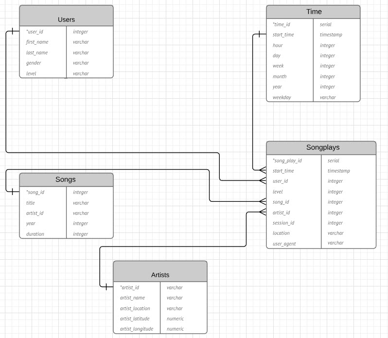
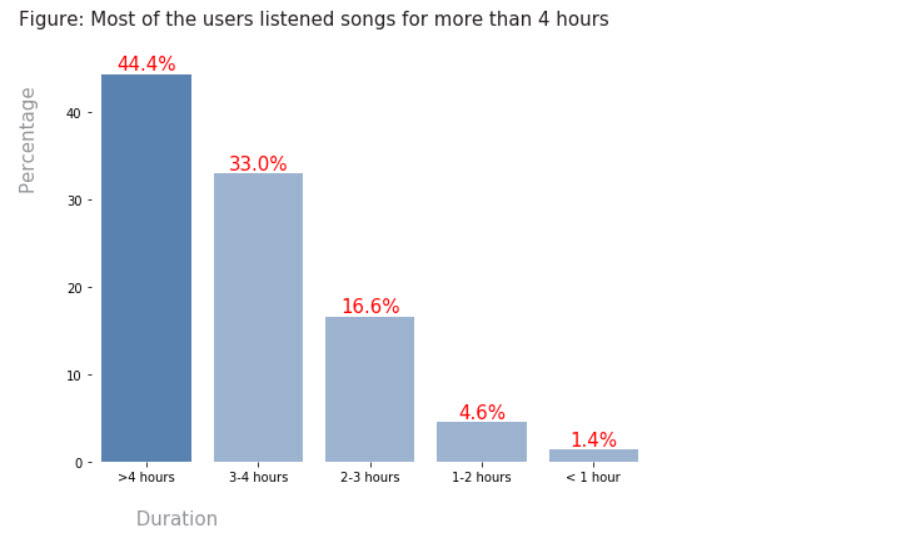
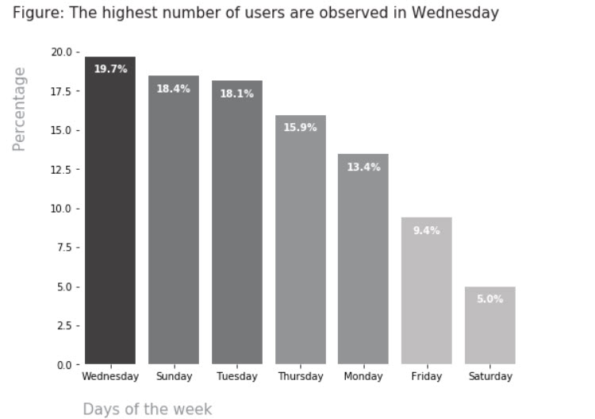

# Data Engineering Nano Degree- Project 3

## 1. Background & Objective of the Project

A music streaming startup, Sparkify, has grown their user base and song database and want to move their processes and data onto the cloud. Their data resides in S3, in a directory of JSON logs on user activity on the app, as well as a directory with JSON metadata on the songs in their app.

The objective of this project is to build an ETL pipeline that extracts their data from S3, stages them in Redshift, and transforms data into a set of dimensional tables for their analytics team to continue finding insights in what songs their users are listening to. At the end of the project, it would be possible to test the database and ETL pipeline by running queries obtained from the analytics team from Sparkify and compare the results with their expected results.

To complete the project, data is loaded from S3 to staging tables on Redshift and execute SQL statements that create the analytics tables from these staging tables.

## 2. Installations

This project was written in Python, using Jupyter Notebook on Anaconda. The relevant Python packages for this project are as follows:

* psycopg2
* configparser
* Pandas
* numpy

To follow the steps it is recommended to install Anaconda, a pre-packaged Python distribution that contains all of the necessary libraries and software for this project.

Psycopg is a PostgreSQL adapter for the Python programming language. It is a wrapper for the libpq, the official PostgreSQL client library. To install psycopg2 you need to run the following in the command prompt : **`pip install psycopg2`**

## 3. Dataset

A. **Song Dataset**: The first dataset is a subset of real data from the [Million Song Dataset](https://labrosa.ee.columbia.edu/millionsong/). Each file is in JSON format and contains metadata about a song and the artist of that song. The files are partitioned by the first three letters of each song's track ID.

B. **Log Dataset**: The second dataset consists of log files in JSON format generated by this [event simulator](https://github.com/Interana/eventsim) based on the songs in the dataset above. These simulate app activity logs from a music streaming app based on specified configurations.The log files used in the dataset are partitioned by year and month. 

## 4. Database schema design and ETL pipeline 

**A Fact** can be described as- "a collection of related data items, which consist of measures and context data. Each fact typically represents a business item, a business transaction, or an event that can be used in analyzing the business or business processes". In this case a business transaction is a song that is played by a particular user.

Hence, the **Fact Table** contains records in log data associated with song plays such as **songplay_id, start_time, user_id, level, song_id, artist_id, session_id, location and user_agent**.

**Dimension** on the other hand -" are the parameters over which we want to perform Online Analytical Processing (OLAP)" **[Ref-6]**. 

In the context of our startup- Sparkify who wants to do a song play analysis to optimize queries on song play, we have defined the following Fact and Dimension tables :

**Dimension Table**: The dimension table contains the attributes related to the song and help to store the context of the business. The dimension table contains the following items-

+ **users**: contain the users in the app and have the following columns- user_id, first_name, last_name, gender, level

+ **songs**: contains the songs in music database and have the song_id, title, artist_id, year, duration

+ **artists** - contains the artists in music database. It has the properties of artist_id, name, location, lattitude, longitude

+ **time** - contains the timestamps of records in songplays broken down into specific units
start_time, hour, day, week, month, year, weekday

Here is how the Entity Relationship Diagram looks like:

In the ERD, the **PRIMARY KEY** in indicated by the * sign

## 5. File Descriptions

1. `create_tables.py` is used to create the fact and dimension tables for the star schema in Redshift. 

2. `etl.py` contains the loading of data from S3 into staging tables on Redshift and then process that data into the analytics tables on Redshift.

3. `sql_queries.py` defines the SQL statements, which will be imported into the two other files above.

4. `dwh.cfg` contains the redshift database information and password that is required to create the data warehouse. 

5. `test.ipynb` is used to read the sql data and create vizualizations.

## 6. Steps

1. For this project it is important to open an Amazon Web Service (AWS) account. Hence, I have cerated an AWS account using the promotional code credits for free as a Udacity student.

2. The I have signed in to the AWS Management Console and open the [**Amazon Redshift console**](https://console.aws.amazon.com/redshift/) On the Amazon Redshift Dashboard, filled the cluster configuration Launch a Redshift dc2.large cluster with 4 nodes that cost 0.25 USD per hour.  

3. Created an [**IAM role**](https://docs.aws.amazon.com/en_us/IAM/latest/UserGuide/id_roles.html) and attached the policy [**AmazonS3ReadOnlyAccess**](https://docs.aws.amazon.com/en_us/IAM/latest/UserGuide/id_roles.html) to the Redshift cluster to load data from Amazon S3 buckets.

4. Tables have been created by running `create_tables.py` first and then the data has been inserted by executing the `etl.py` file. 

5. The **Query Editor** is used to varify the table schemas in the redshift database. **Here is an example query:**

## 7. Run

1. To create new tables and drop pre-existing tables with similar name run `create_tables.py` write the following in the terminal : **`python create_tables.py`**

2. To extract JSON data from the s3 bucket and insert them into Rexecute run : `python etl.py` in the terminal. It takes around 10 minutes for the ELT process to finish.

## 8. Vizualizations

To show the usefulness of the datawarehouse some vizualizations have been created below: 

# A. Who Are the visitors ?

# B. How long do the users listen to music ?

# C. What is the most popular day of the week?

# D. When did the most popular songs came out?

## 8. References

1. Course Content : [Udacity Data Engineerg Nanodegree](https://eu.udacity.com/course/data-engineer-nanodegree--nd027)

2. Basic Syntax for using [Markdown](https://www.markdownguide.org/basic-syntax/) 

3. For selecting the appropriate datatype: Tuotial [PostgreSQL](http://www.postgresqltutorial.com/)

4. For general issues related to python and dataframe: [Stackoverflow](https://stackoverflow.com/)

5. Style Guide for Python Code [PEP 8](https://www.python.org/dev/peps/pep-0008/) has been followed

6. Basics explanation of [Fact and Dimension Table](https://medium.com/@BluePi_In/deep-diving-in-the-world-of-data-warehousing-78c0d52f49a)

7. Plot Colors From : [this Github repository](https://github.com/empathy87/storytelling-with-data)